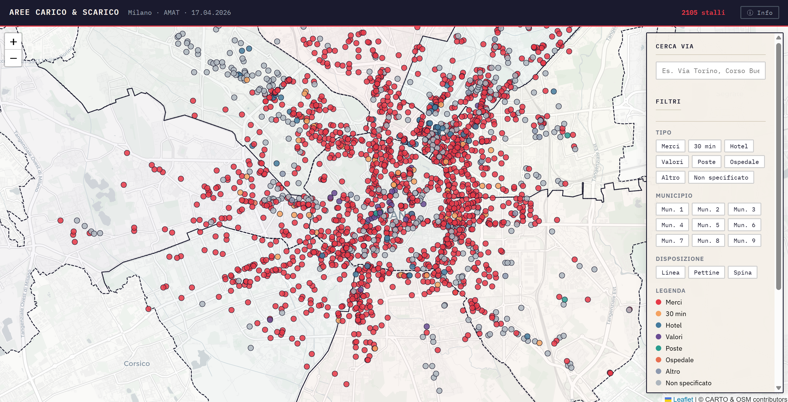

# Aree di Carico e Scarico - Comune di Milano

Richiesta di accesso inoltrata all'Agenzia Mobilità Ambiente Territorio (AMAT).

**Codice richiesta**: 275-2026106-094822-1875263

## Struttura della cartella

```
aree-carico-scarico/
├── Raw/
│   ├── 20260417_stalli_caricoscarico.shp
│   ├── 20260417_stalli_caricoscarico.dbf
│   ├── 20260417_stalli_caricoscarico.shx
│   ├── 20260417_stalli_caricoscarico.prj
│   ├── 20260417_stalli_caricoscarico.cpg
│   └── 20260417_stalli_caricoscarico.qmd
├── aree-carico-scarico.csv
└── mappa_aree_carico_scarico_milano.html
```
File contenenti lo shape estratto dal DB AMAT della sosta su strada, con le aree carico scarico (tutte le tipologie) presenti nel territorio di Milano con l’aggiornamento all’ultimo passaggio del rilevatore (2022/2026)

**File Raw (shapefile)**: 
Shapefile fornito da AMAT contenente 2.105 stalli di carico e scarico merci sul territorio del Comune di Milano. Le geometrie sono di tipo LineString nel sistema di riferimento EPSG:3003 (Gauss-Boaga Ovest). I campi disponibili sono:

| Campo | Descrizione |
|-------|-------------|
| `id` | Identificativo univoco dello stallo |
| `tipo_area` | Tipologia dell'area (es. carico scarico merci) |
| `dettaglio` | Dettaglio sulla tipologia |
| `ora_inizio` | Orario di inizio validità |
| `ora_fine` | Orario di fine validità |
| `disposizio` | Disposizione fisica (es. linea) |
| `posti` | Numero di posti disponibili |

**File CSV (`aree-carico-scarico.csv`)**:
Versione tabellare dei dati, derivata dalla mappa interattiva. Contiene 2.105 righe con le stesse colonne dello shapefile più `municipio`, `longitudine` e `latitudine` (coordinate del centroide in WGS84).

**File HTML (`mappa_aree_carico_scarico_milano.html`)** · [Apri mappa ↗](https://simonebussu.github.io/dati-milano-trasparenza/aree-carico-scarico/mappa_aree_carico_scarico_milano.html):
Mappa interattiva generata a partire dallo shapefile. Gli stalli sono visualizzati come punti (centroide della geometria, riproiettati in WGS84) con i confini dei 9 municipi di Milano sovrapposti. È stato aggiunto il campo `municipio` tramite spatial join con i confini municipali.



## Testo richiesta inoltrata

**Periodo temporale**: dato più recente disponibile

**Informazioni richieste**:
si chiede l'accesso al dataset relativo alla localizzazione geografica delle aree di carico e scarico merci presenti sul territorio del Comune di Milano, ivi incluse le zone a uso esclusivo e quelle a uso promiscuo, nelle seguenti informazioni minime:
- numero complessivo delle aree censite;
- localizzazione geografica di ciascuna area (coordinate o geometria spaziale);
- indirizzo o riferimento viario;
- eventuale indicazione del municipio o zona di appartenenza;
- eventuali attributi descrittivi disponibili (dimensione, tipologia, orari, limitazioni).

**Formato richiesto**:
si chiede che i dati siano forniti, ove possibile, in uno o più dei seguenti formati aperti e machine-readable:
- GeoJSON
- CSV con colonne di coordinate geografiche (latitudine/longitudine, sistema di riferimento WGS84)


